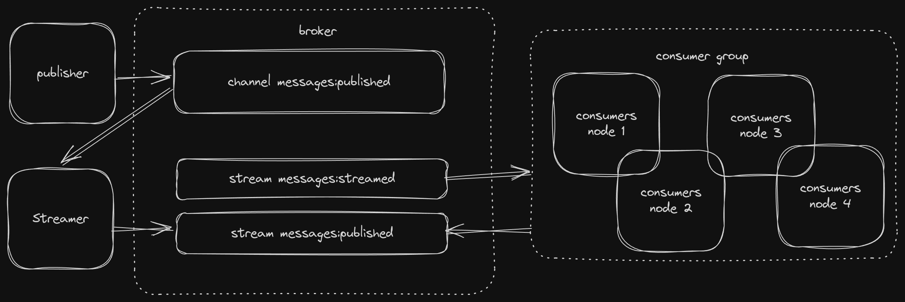

# Distributed golang app using Redis pubsub channels and streams with consumer groups

## Architecture

* Have I used redis before? No.
* What am I showcasing? Not sure.
* Does it make sense? No, but it can be handy in specific use cases, I guess, e.g. you want to persist a pubsub channel and scale horizontally the consumers.

## How to run?

### Using docker compose for everything
```shell
sudo docker compose up -d
```
or run locally
### Set env vars
```shell
export $(grep -v '^#' .env | xargs)
```
### Run broker
```shell
sudo docker compose up -d broker
```

### Build
```shell
go build -o consumer-cli cmd/consumer-cli/main.go
```

### Show help
```shell
./consumer-cli --help
```

### Run streamer
```shell
./consumer-cli stream messages:published messages:streamed
```

### Run consumer group
```shell
./consumer-cli consume messages:streamed --size=8 --limit=100
```

### Run monitor
```shell
./consumer-cli monitor messages:processed --size=8 --limit=100
```

## Publisher
After everything is running, simulate publishers by running the script below
```shell
python3 scripts/publisher.py
```

## Monitor logs
```shell
sudo docker compose logs -f monitor
```
